=====================
Software Installation
=====================

.. contents:: :depth: 4

Setting up your Raspberry Pi
------------------------------

* Raspberry Pi 4(2GB DDR for normal use, 4GB DDR for install and debug by self)
*  SD Card (32GB recommended)
*   Raspberry Pi 4 power supply (USB-C, 5V, >=3A)
*    Ethernet cable

Preparing the Pi's SD card
^^^^^^^^^^^^^^^^^^^^^^^^^^^^^^^^^

From your desktop / laptop:

1. Put the SD card into your desktop / laptop. 
###############################################

2. Download this version of Ubuntu 18.04.5 LTS 
#################################################################

Download Ubuntu server version 64bit image(NOT including desktop). Use `this version <https://drive.google.com/file/d/1dBjgWEJNBan4NsPyrdhViQJymkSypeIp/view?usp=sharing>`_ so everyone is using the same version. Unzip and extract the file. 
You can also check the version from `ubuntu offical website. <https://releases.ubuntu.com/bionic/>`_ 

3. Use `etcher <https://www.balena.io/etcher/>`_ to flash the card. 
##########################################################################################

* For quick start, you can also download the  `pre-installed image <https://drive.google.com/file/d/16pfS7e765MsS6gidacJCiBaMOjwlPwq-/view?usp=sharing>`_ , (username: ubuntu ,  password: mangdang ) flash it into the card, then skip all the following steps and start to calibarte the Pupper Mini.

* If you are using the recommended etcher, this is the start-up menu. Select ubuntu-18.04.5-preinstalled-server-arm64+raspi4.img (file inside zip )and the SD card. 

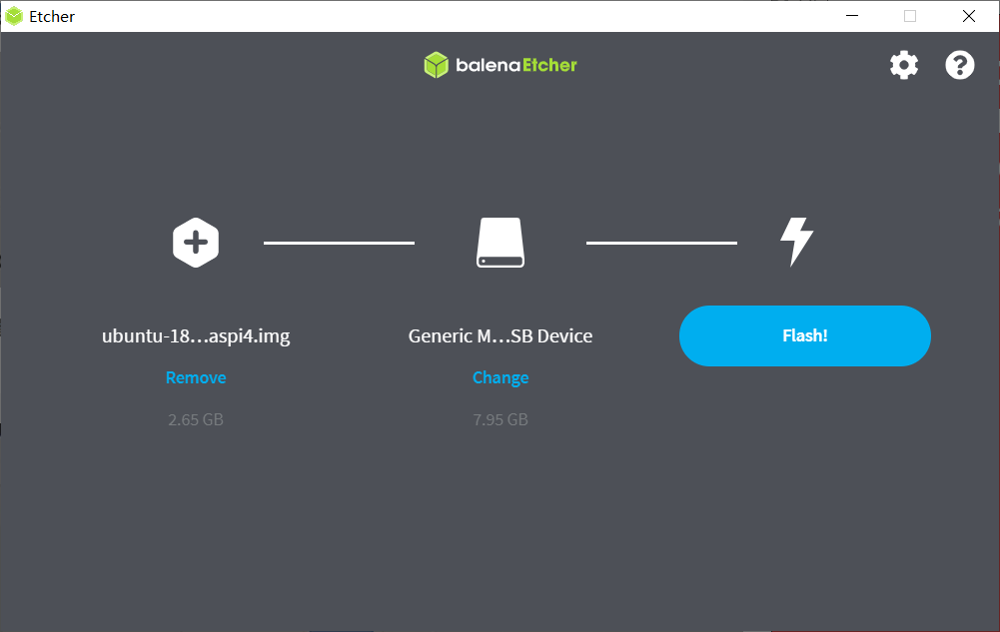

*  Image of SD card being flashed. 

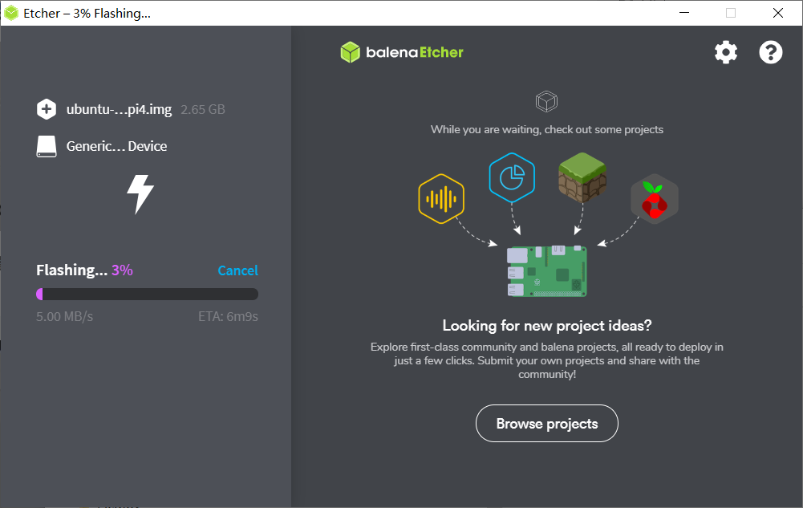

*   Done!

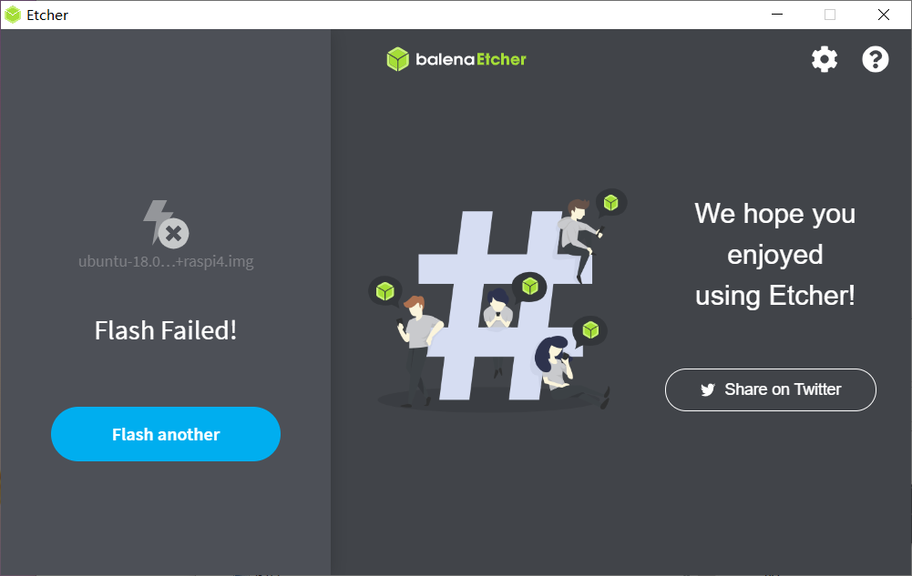

Enabling Basic Functionality
^^^^^^^^^^^^^^^^^^^^^^^^^^^^^^^^^^^^^^^^^^^^^^^^^^^^^

1. Turn on your Raspberry Pi. 
###################################################################################################
Remove SD card from computer and put it into your Raspberry Pi. 
Connect the IO board to the Pi,
Connect battery power from IO board power interface,
Connect keyboard, and mouse to the Pi as well. 
Connect the Pi to a displayer by HDMI line. 
Switch power on/off button to set up the Pi.
Follow the prompts to change the password((The default password is ``mangdang``)), and then install desktop.
Before installation, please make sure that raspberry pi is plugged into the network cable to access the Internet. 
After installing the desktop, you only need to reboot it one time. The system will enter the desktop system by default.

Run ``$sudo apt install ubuntu-desktop`` 

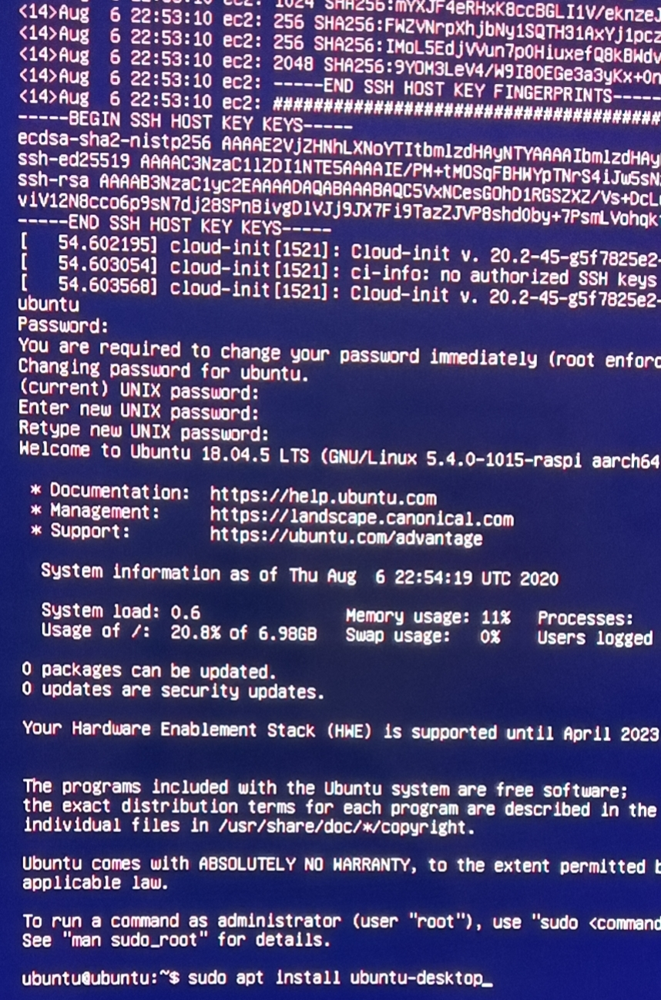

2. Initial Ubuntu server
######################################################## 

* The install time depends on your network speed, probably dozens of minutes. 

Input "Y" to continue.

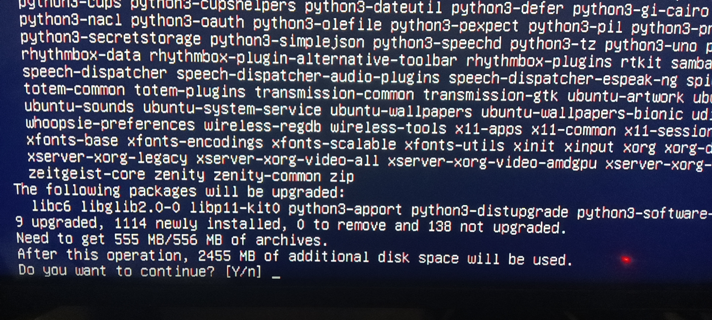

Input "startx" to boot up desktop at first time.

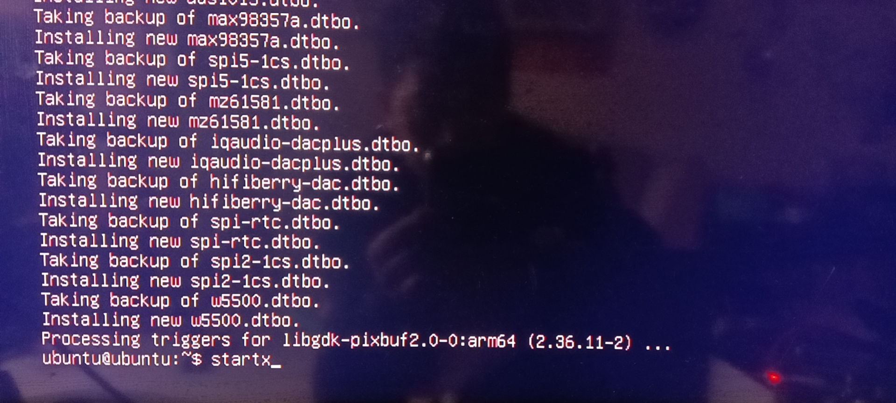

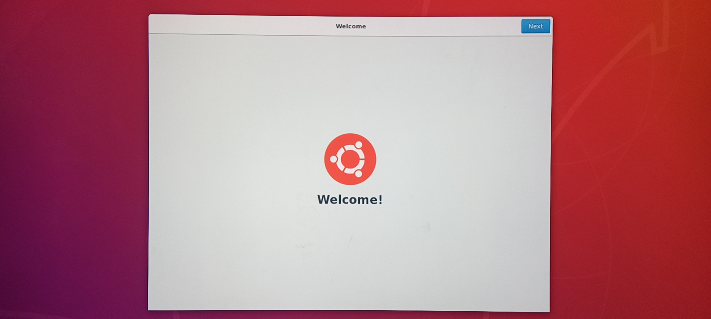

After initial setting, looks like the below picture.

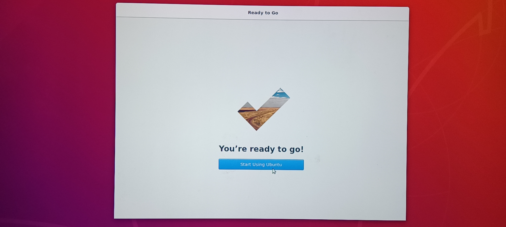

Reboot it only at first time, and then check the IP address, you can connect it later by SSH.

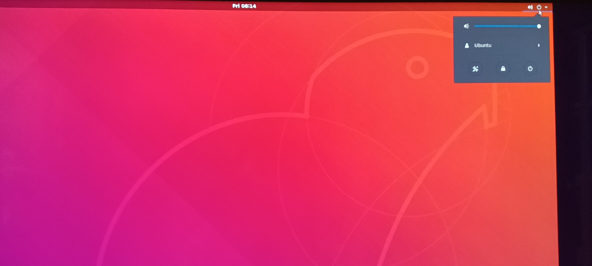

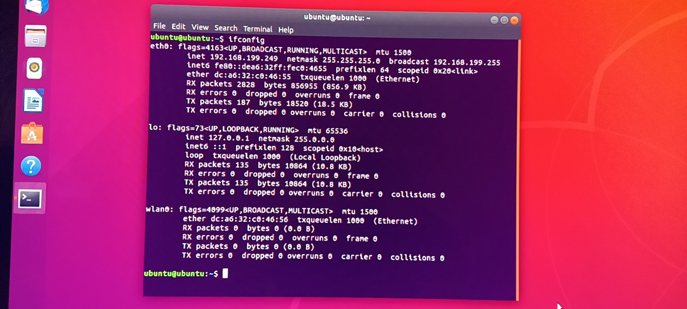

2. SSH into the pi from your computer and install the robot program.
######################################

Run ``ssh ubuntu@IP address`` (The default password is ``mangdang``)

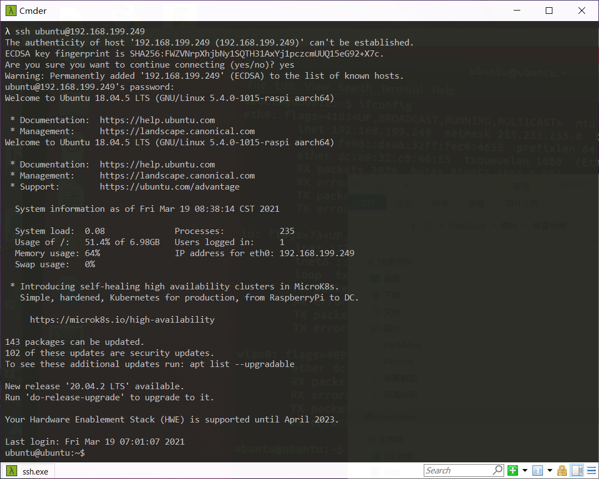

Make ``Robotics`` folder and download the source code.
Run ``git clone -b MiniPupper https://github.com/mangdangroboticsclub/QuadrupedRobot.git``

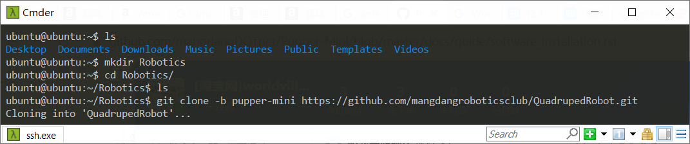

Install requirements (on the Pi).
Run ``sudo bash pre_install.sh``, the pre-install time depends on your network speed, maybe dezons of minutes, or several hours.

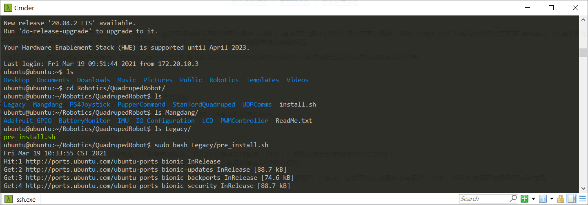

Insall the pupper robot program.
	* ``cd QuadrupedRobot``
	* ``sudo bash install.sh``

3. Power-cycle the robot
#############################
Unplug the battery, wait about 30 seconds, and then plug it back in.

4. Verify everything is working
###############################

#. If you just powered on the Pi, wait about 30 seconds until the green light stops blinking.
#. SSH into the robot
    
    * Run ``ssh pi@10.0.0.xx (where xx is the IP address you chose for the robot)``

#. Check the status for the joystick service 

    * Run ``sudo systemctl status joystick``
    * If you haven't yet connected the PS4 controller, it should say something like ::
        
        pi@pupper(rw):~/StanfordQuadruped$ sudo systemctl status joystick
        ● joystick.service - Pupper Joystick service
        Loaded: loaded (/home/pi/PupperCommand/joystick.service; enabled; vendor preset: enabled)
        Active: active (running) since Sun 2020-03-01 06:57:20 GMT; 1s ago
        Main PID: 5692 (python3)
            Tasks: 3 (limit: 4035)
        Memory: 7.1M
        CGroup: /system.slice/joystick.service
                ├─5692 /usr/bin/python3 /home/pi/PupperCommand/joystick.py
                └─5708 hcitool scan --flush

        Mar 01 06:57:20 pupper systemd[1]: Started Pupper Joystick service.
        Mar 01 06:57:21 pupper python3[5692]: [info][controller 1] Created devices /dev/input/js0 (joystick) /dev/input/event0 (evdev)
        Mar 01 06:57:21 pupper python3[5692]: [info][bluetooth] Scanning for devices

#. Connect the PS4 controller to the Pi by putting it pairing mode.
    
    * To put it into pairing mode, hold the share button and circular Playstation button at the same time until it starts making quick double flashes. 
    * If it starts making slow single flashes, hold the Playstation button down until it stops blinking and try again.

#. Once the controller is connected, check the status again 

    * Run ``sudo systemctl status joystick``
    * It should now look something like::

        pi@pupper(rw):~/StanfordQuadruped$ sudo systemctl status joystick
        ● joystick.service - Pupper Joystick service
        Loaded: loaded (/home/pi/PupperCommand/joystick.service; enabled; vendor preset: enabled)
        Active: active (running) since Sun 2020-03-01 06:57:20 GMT; 55s ago
        Main PID: 5692 (python3)
            Tasks: 2 (limit: 4035)
        Memory: 7.3M
        CGroup: /system.slice/joystick.service
                └─5692 /usr/bin/python3 /home/pi/PupperCommand/joystick.py

        Mar 01 06:57:20 pupper systemd[1]: Started Pupper Joystick service.
        Mar 01 06:57:21 pupper python3[5692]: [info][controller 1] Created devices /dev/input/js0 (joystick) /dev/input/event0 (evdev)
        Mar 01 06:57:21 pupper python3[5692]: [info][bluetooth] Scanning for devices
        Mar 01 06:58:12 pupper python3[5692]: [info][bluetooth] Found device A0:AB:51:33:B5:A0
        Mar 01 06:58:13 pupper python3[5692]: [info][controller 1] Connected to Bluetooth Controller (A0:AB:51:33:B5:A0)
        Mar 01 06:58:14 pupper python3[5692]: running
        Mar 01 06:58:14 pupper python3[5692]: [info][controller 1] Battery: 50%
    * If the pi can't find the joystick after a minute or two, it's possible that the pi's bluetooth controller was never turned on. Run ``sudo hciconfig hci0 up`` to turn the radio on. Then restart the pi.

#. Check the status of the robot service

    * Run ``sudo systemctl status robot``
    * The output varies depending on the order of you running various programs, but just check that it doesn't have any red text saying that it failed.
    * If it did fail, usually this fixes it: ``sudo systemctl restart robot``

7. Done!
#########

Continue to Calibration.
