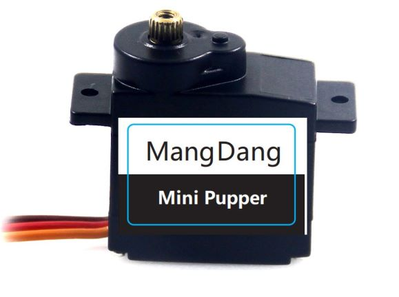
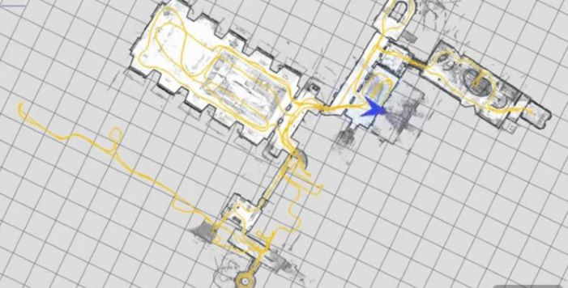

# Mini Pupper Quadruped

## 12 DOF Quadruped Robot with Navigation Technology for Education
Mini Pupper comes from Stanford Pupper led by [Nathan Kau](https://github.com/stanfordroboticsclub/StanfordQuadruped), it is a mini pupper that can hop, trot, and run around. Its low cost, simple design and rich functions especially the potential navigation system will allow robot enthusiasts in K-12 and beyond to get their hands on fun, dynamic robots.

This repository hosts the code for Mini Pupper Robot, Raspberry Pi-based quadruped robots. The project is generously supported by [Stanford Student Robotics](http://roboticsclub.stanford.edu/) led by [Nathan Kau](https://github.com/stanfordroboticsclub/StanfordQuadruped) and [MangDang Technology Co., Limited](https://www.mangdang.net/)

Video of Mini Pupper in action:
- https://youtu.be/fVB2cYGYmbU
- https://youtu.be/cRrh5mLGNMc

Link to project page: https://github.com/mangdangroboticsclub/QuadrupedRobot/tree/MiniPupper

## Design Introduction
We are incredibly pleased to introduce Mini Pupper! Our consumer friendly, low-cost, open source, 12 DOF with navigation technology education product. Even though this is a full-blooded quadruped robot, we are targeting this for the number one use that consumers tell us they want a quadruped robot for. which is to Learn and Study the unlimited potentials of quadruped robots. And that's what this product is targeted for. And it will be the NUMBER ONE education platform for quadruped robotics in the world, and we think Mini Pupper is going to be a very big deal. 

Beginning last year, we shipped many Stanford Pupper units worldwide. After such global success with Pupper we took to heart all the feedback from this endeavor. What do our customers want in our products? What kind of products do they like? After more than 11 months pursuing these requests, we would like to show you what we came up with. Mini Pupper!

Our Mini Pupper servo is a custom servo to meet the requirements of our NEW Pupper! Compact, Durable, Unique. In order to run the Mini Pupper organically and smooth, high torque & high-fidelity servos were required. We tested many servos on the market and have not found any 9g servo up to the task.  After too many Q.C issues we finally gave up on off the shelf hobbyist servos, the last thing MangDang wants is for our intelligent customers being let down by poor quality of servos. Damn it, the feeling was so bad at that time. So, we spent several months optimizing and configuring a servo that would work for our project. Tuned the servo parameters ourselves! Now named Mini Pupper servo. You can use our Mini Pupper to explore many gait performances, such as, Trot (diagonal pairs), Pace (lateral pairs), and the Bound (front and rear pairs). We’re confident our Mini Pupper Servos will outperform any servo for the balance of performance and price.

The mechanical design is simple, stable and beautiful. You can find many prototype quadruped robots, but few can go to market because of its complex design! Difficult to assemble, lack stability while trotting and require unpredictable costly repairs. For the average engineering student or extremely curious individual these quadrupeds will work, however they are not suitable for mass production... The Mini Pupper addresses these issues by creating a professional robot designed specifically for mass production, Driving Unit costs low enough for even low budget schools to acquire the robots for learning. Driving innovation for the next generation of robotics enthusiasts. Unlike other 3D printed robots MangDang uses brass thread inserts to ensure customers can disassemble and reassemble easily while making repairs after extensive use. All parts are secured with quality fasteners ensuring great fit and function as well as durability of the unit. 
Cleaner builds were achieved by customizing the servo cable length and integrating the IMU into our carry board in order to reduce wiring necessary and have an overall clean setup in the body of Mini Pupper. No lose wires! Unlike other enthusiast made kits, our Mini Pupper does not require the user plug or unplug wires to power the unit on and off. A simple flick of a switch is all you need! The Mini Pupper battery is charged without the need to remove the battery from the robot, onboard volt meters will sound alarm and worn you that your unit needs energy. Mini Puppers design was based off the feedback we received from our existing customers. Because of this we now have a Quadruped robot easier to setup and play with than any other robot on the market, Customers with minimal or NO experience will be able to use this robot. Mini Pupper is the first consumer quadruped robot with this price point IN THE WORLD.

The Mini Pupper has 12 DOF (degree of freedom), UNLIKE the 8 DOF available through similar projects. There was a lot of debate within our team of whether we should keep with norms and produce the same 8 DOF. After much debate we came to the conclusion 8 DOF robots lack the ability to follow natural biological movements. The benefits of a 8 DOF quadruped only seemed to benefit the producer as the cost of the robot and parts required would be less. But we would have lost the original inspiration of the project… Which was to provide our customers with the highest quality best performing robot in this price range.   All the servos are controlled one by one by a PCA9685. The gait performance is dependent on the 12 servos Loop Control Time, requiring more effort to optimize 12 DOF vs 8DOF. There were doubts we could accomplish this with such a low price point. Although it was a challenge, after several months Mini Pupper is the first consumer 12 DOF quadruped robot in the world with a mass production intention.

The HMI (Human-Machine-Interface) LCD is another wonderful function. Taking Mini Pupper from a bunch of screws and motors, an animalistic appearance is given to Mini Pupper. You can communicate with it, you can customize it. Mini Pupper is the first consumer quadruped robot with LCD’s adding animal behaviors to your robot. 

Puppers software is based on Raspberry OS(Linux), and Mini Pupper is based on Ubuntu. The main software improvement from Pupper is our FSN (Full Self-Navigation) system, based on Ubuntu & ROS. We are moving forward fast to FSN target step by step. The SLAM (Simultaneous Localization and Mapping), navigation, AI (Artificial intelligence) functions are all coming soon. The interfaces are all open, we absolutely welcome people to contribute to the project. 

If you want to join us and move together with us, please don't hesitate to send us email! Let’s together make possibilities to realities and improve Mini Pupper to be the first consumer quadruped robot with navigation function in the world for mass production.

We are targeting Mini Pupper for education. The education courses are also coming. In order to make the study of Mini Pupper easy and convenient, the courses will be released step by step, including mechanical, hardware, ROS, SLAM, navigation, AI functions and so on. If you’ve been searching for an open sourced consumer grade quadruped research robot, Mini Pupper is the best platform for you.

Mini Pupper is incredible compared to anything else out there. It looks like it’s from another planet, Mars?

## How it works smarter

The main software improvements from Pupper is our FSN (Full Self-Navigation) system, based on Ubuntu&ROS. We are moving forward to FSN target step by step. The interface is also open, we absolutely welcome people to contribute to the project. If you want to join us and move together with us, please don't hesitate to send us email!(sales@mangdang.net)

## How to Build 
To get started, check out the pages linked below on part sourcing and assembly.  
- BOM list: https://drive.google.com/file/d/18phJat8GdK5Yq5p4K1ZmfY1-nMf1lQw4/view?usp=sharing
- Fusion 360 CAD model: https://a360.co/3fS15a1
- Assembly Instructions: https://drive.google.com/file/d/12Xbnqv3Rm7TEcjBZVSbVkBVNKNO3IOfm/view?usp=sharing

- Software Installation: https://github.com/mangdangroboticsclub/QuadrupedRobot/blob/pupper-mini/Doc/guide/software_installation.rst
- Calibration Instruction and video guide: 
   https://drive.google.com/file/d/1GKVg3EnKxrpOwSu_p4mhcSkNuLoSejXy/view?usp=sharing    
   https://youtu.be/oMQS_zwIw40
- Robot operation(same with pupper): https://pupper.readthedocs.io/en/latest/guide/operation.html

## How to Purchase 
If you purchase the parts yourself one by one, it’ll run you about $800 and more time. However, you can purchase a kit to build the robot from MangDang channel for cheaper, and the key point is that you can buy everything at once and save your much time.
- Amazon channel: [Mini Pupper Amazon US](https://www.amazon.com/s?me=A3V5171RNQ5C18&marketplaceID=ATVPDKIKX0DER) , [Mini Pupper Amazon Japan](https://www.amazon.co.jp/s?me=A14LOTMOI42BRX&marketplaceID=A1VC38T7YXB528)
- Paypal channel: MangDang Paypal account is afreez.gan@gmail.com
- Aliexpress channel: [Mini Pupper Aliexpress](https://www.aliexpress.com/store/911381222?spm=a2g0o.detail.1000007.1.2ed464e6sdYBwy)

About FAQ, please refer to https://groups.google.com/g/minipupper/c/D6u_4VIbKQM

## Help
- Feel free to raise an issue (https://github.com/mangdangroboticsclub/QuadrupedRobot/issues) or send mail to fae@mangdang.net
- We also have a Google group set up here: https://groups.google.com/g/minipupper

## About Stanford Student Robotics
[Stanford Student Robotics](https://stanfordstudentrobotics.org/) is an entirely student-run group dedicated to building cool robots and learning new things. You can find many amazing projects on the website. Mini Pupper project is strongly supported by [Nathan Kau](https://github.com/stanfordroboticsclub/StanfordQuadruped) from Stanford Student Robotics.

## About MangDang Technology
Founded in 2020, [Mangdang Technology Co., Limited](https://www.mangdang.net/) (Mangdang) specializes in the research, development, and production of robot products that make peoples lives better. Mangdang is headquartered in HongKong, with R&D offices in Beijing. We are a global team with members from many countries and regions such as the United States, Japan, Canada, Europe, China and so on.
- Mission: Using AI to make life better.
- Vision: Every home, every one can use our robot product to make life better.

We are all dreamers, we look forward to connecting talents worldwide and innovating together to perform splendid times! 
- For business, you can connect us by mail(sales@mangdang.net).
- Beijing Office address: Innostyle, Building 5, No.36 Haidian West Street, Haidian District, Beijing, China.
- Our online channel: [Youtube](https://www.youtube.com/channel/UCqHWYGXmnoO7VWHmENje3ug/featured), [Twiter](https://twitter.com/LeggedRobot), [FaceBook](https://www.facebook.com/afreez.gan/) 
