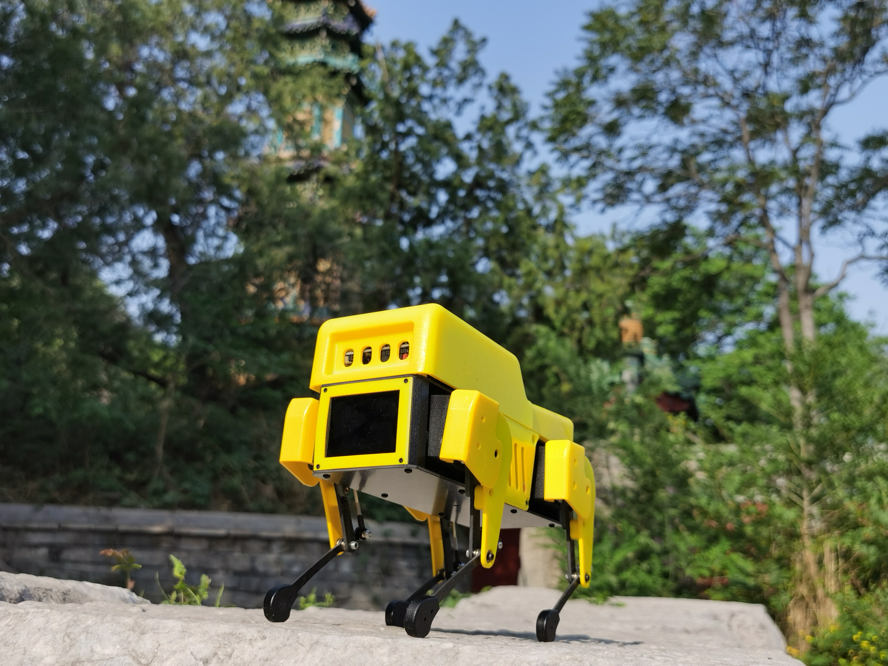
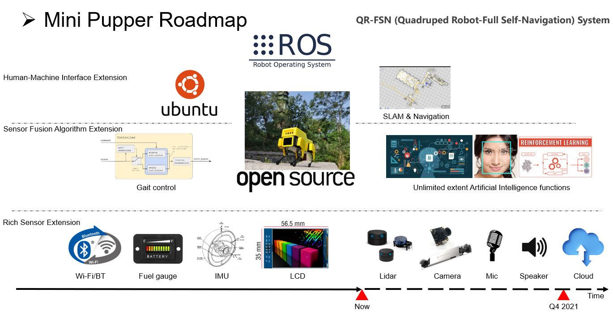

# Mini Pupper Quadruped Project

## Overview
Mini Pupper comes from Stanford Pupper led by [Nathan Kau](https://github.com/stanfordroboticsclub/StanfordQuadruped), it is a mini pupper that can hop, trot, and run around. Its low cost, simple design and rich functions especiall the potential self navigation system will allow robot enthusiasts in K-12 and beyond to get their hands on fun, dynamic robots.
This repository hosts the code for Mini Pupper Robot based on Stanford Pupper, Raspberry Pi-based quadruped robots that can trot, walk, and jump. The project is generously supported by [Stanford Student Robotics](http://roboticsclub.stanford.edu/) led by [Nathan Kau](https://github.com/stanfordroboticsclub/StanfordQuadruped) and [MangDang Technology Co., Limited](https://www.mangdang.net/)


Video of Mini Pupper in action:
- https://youtu.be/fVB2cYGYmbU
- https://youtu.be/cRrh5mLGNMc
- One more thing is coming

Link to project page: https://github.com/mangdangroboticsclub/QuadrupedRobot/tree/pupper-mini

## How it works basicly

This section is copied from [here](https://github.com/stanfordroboticsclub/StanfordQuadruped) wrote by Nathan.
The main program is ```run_robot.py``` which is located in ```QuadrupedRobot\StanfordQuadruped``` directory. The robot code is run as a loop, with a joystick interface, a controller, and a hardware interface orchestrating the behavior. 

The joystick interface is responsible for reading joystick inputs from a UDP socket and converting them into a generic robot ```command``` type. A separate program, ```joystick.py```, publishes these UDP messages, and is responsible for reading inputs from the controller over bluetooth. The controller does the bulk of the work, switching between states (trot, walk, rest, etc) and generating servo position targets. A detailed model of the controller is shown below. The third component of the code, the hardware interface, converts the position targets from the controller into PWM duty cycles, which it then passes to a Python binding to ```PCA9685```, which then generates PWM signals in software and sends these signals to the motors attached to the Raspberry Pi.

This diagram shows a breakdown of the robot controller. Inside, you can see four primary components: a gait scheduler (also called gait controller), a stance controller, a swing controller, and an inverse kinematics model. 

The gait scheduler is responsible for planning which feet should be on the ground (stance) and which should be moving forward to the next step (swing) at any given time. In a trot for example, the diagonal pairs of legs move in sync and take turns between stance and swing. As shown in the diagram, the gait scheduler can be thought of as a conductor for each leg, switching it between stance and swing as time progresses. 

The stance controller controls the feet on the ground, and is actually quite simple. It looks at the desired robot velocity, and then generates a body-relative target velocity for these stance feet that is in the opposite direction as the desired velocity. It also incorporates turning, in which case it rotates the feet relative to the body in the opposite direction as the desired body rotation. 

The swing controller picks up the feet that just finished their stance phase, and brings them to their next touchdown location. The touchdown locations are selected so that the foot moves the same distance forward in swing as it does backwards in stance. For example, if in stance phase the feet move backwards at -0.4m/s (to achieve a body velocity of +0.4m/s) and the stance phase is 0.5 seconds long, then we know the feet will have moved backwards -0.20m. The swing controller will then move the feet forwards 0.20m to put the foot back in its starting place. You can imagine that if the swing controller only put the leg forward 0.15m, then every step the foot would lag more and more behind the body by -0.05m. 

Both the stance and swing controllers generate target positions for the feet in cartesian coordinates relative the body center of mass. It's convenient to work in cartesian coordinates for the stance and swing planning, but we now need to convert them to motor angles. This is done by using an inverse kinematics model, which maps between cartesian body coordinates and motor angles. These motor angles, also called joint angles, are then populated into the ```state``` variable and returned by the model. 

## How it works smarter

The main software improvements from Pupper is our FSN (Full Self-Navigation) system, based on Ubuntu&ROS. We are moving forward to FSN target step by step. The interface is also open, we absolutely welcome people to contribute to the project. If you want to join us and move together with us, please don't hesitate to send us email!(sales@mangdang.net)

## How to Build 
To get started, check out the pages linked below on part sourcing and assembly. If you purchase the parts yourself, it’ll run you about $800. However, you can purchase a kit to build the robot from [MangDang](https://www.mangdang.net/Product) for cheaper than what it would cost you to get the parts yourself. 
- BOM list: https://drive.google.com/file/d/18phJat8GdK5Yq5p4K1ZmfY1-nMf1lQw4/view?usp=sharing
- Fusion 360 CAD model: https://a360.co/3yo0fu3
- Assembly Instructions: https://drive.google.com/file/d/12Xbnqv3Rm7TEcjBZVSbVkBVNKNO3IOfm/view?usp=sharing

- Software Installation: https://github.com/mangdangroboticsclub/QuadrupedRobot/blob/pupper-mini/Doc/guide/software_installation.rst
- Calibration Instruction and video guide: https://drive.google.com/file/d/1GKVg3EnKxrpOwSu_p4mhcSkNuLoSejXy/view?usp=sharing    https://youtu.be/oMQS_zwIw40
- Robot operation(same with pupper): https://pupper.readthedocs.io/en/latest/guide/operation.html

## Help
- Feel free to raise an issue (https://github.com/mangdangroboticsclub/QuadrupedRobot/issues) or send mail to fae@mangdang.net
- We also have a Google group set up here: https://groups.google.com/g/minipupper


